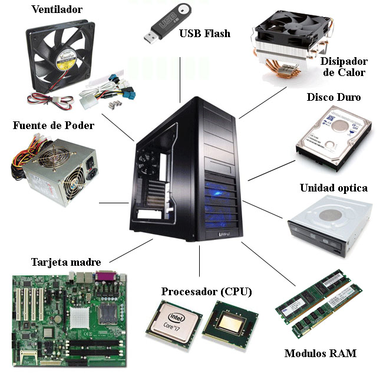

Unidad 1 - Introducción
-----------------------

Que es una PC
=============

    * Es una máquina electrónica que recibe y procesa datos para convertirlos 
      en información útil. 
    * Dispositivo electrónico compuesto básicamente de procesador, memoria y
      dispositivos de entrada/salida. Poseen parte física (hardware) y parte
      lógica (software), que se combinan entre sí para ser capaces de
      interpretar y ejecutar instrucciones para las que fueron programadas. Una
      computadora suele tener un gran software llamado sistema operativo que 
      sirve como plataforma para la ejecución de otras aplicaciones o
      herramientas.
    * Dispositivo mecánico-electrónico que procesa Información
      (numérica, alfanumérica) capaz  elaborar gráficos, imágenes, diseños,
      sonidos y  le  brinda una  gama  de  información  al usuario de una
      manera  fácil , sencilla y  Práctica.

Componentes de una PC
=====================

    * Dispositivos (harware interno)
        
        * Placamadre
        * Procesador
        * Memoria RAM
        * Fuente de Alimentación
        * Disco rigido(HDD)
        
    * Perifericos (hardware externo)
        
        * Monitor
        * Teclado
        * Mouse
        * Impresora
        * Escaners
        
Tipos de PC y sus diferencias
=============================

    * Portatiles
    
        * Computadoras portátiles
        * Transportables.
        * Livianas(1 - 3 kg).
        * Pueden funcionar con batería(autonomía).
        * Dificultad para su reparación.
        * Dificil actualización.
        
    * De escritorio
        
        * Computadoras hogareñas o de trabajo.
        * Dificil de transportar.
        * Accesibles para reparar.
        * Fácil de actualizar.
        * Funcionan conectadas a la corriente electrica.

---

    
    Componentes de una PC
